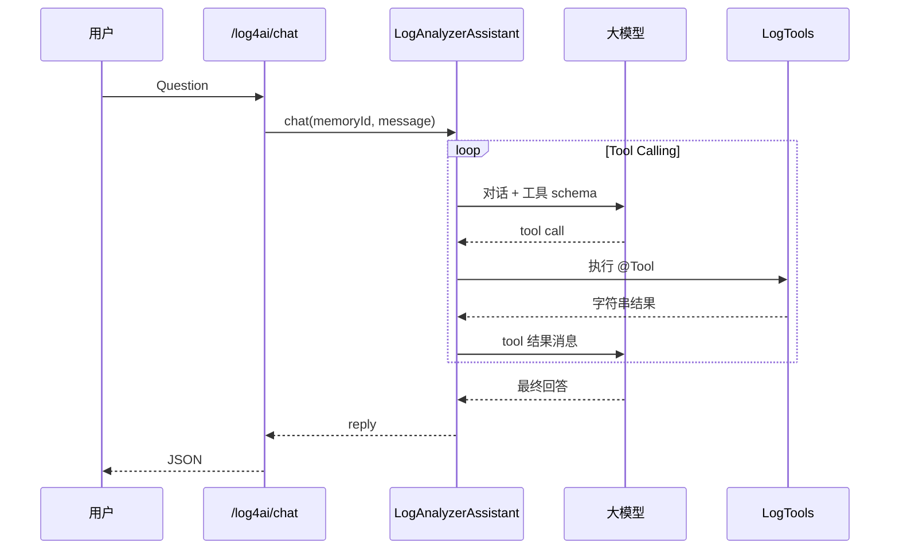

# Spring Boot Log4AI

基于 **LangChain4j** 的 Spring Boot **自动配置库**：在应用中配置兼容 OpenAI API 的大模型后，通过 **智能体 + 函数调用（Tool Calling）** 对**本机活动日志**与**历史/归档日志（含 `.gz`）**做检索，由模型根据工具返回的摘要生成分析与建议。

**定位**：日志检索在**应用进程所在机器**上读本地文件；适合各业务工程引入 Starter **就地分析本服务日志**。若需「一台中央服务读所有机器日志」，须配合共享存储或日志汇聚（见下文「部署注意」）。

---

## 目录

- [前置条件](#前置条件)
- [详细接入步骤](#详细接入步骤)
- [运行模式：组件嵌入 vs 独立 JAR](#运行模式组件嵌入-vs-独立-jar)
- [Docker 部署（standalone）](#docker-部署standalone)
- [公共镜像库发布方案（文档）](docs/docker-registry-publish.md)
- [Maven Central 发布（文档）](docs/maven-central-publish.md)
- [技术架构与用户执行链路（文档）](docs/technical-architecture-user-flow.md)
- [内置控制台与静态页](#内置控制台与静态页)
- [生产环境：日志服务注册（可选）](#生产环境日志服务注册可选)
- [HTTP 接口](#http-接口)
- [多服务与日志路径](#多服务与日志路径)
- [暴露给模型的工具](#暴露给模型的工具)
- [ReAct 与 Tool Calling（设计核心）](#react-与-tool-calling设计核心)
- [架构与自动配置](#架构与自动配置)
- [GitHub Actions](#github-actions)
- [验证与排错](#验证与排错)
- [与全面上云的 AIOps 对比](#与全面上云的-aiops-对比)
- [License](#license)

---

## 前置条件

| 项 | 说明 |
|----|------|
| **JDK** | **1.8+**（当前 `feat/jdk8-compat` 兼容线已按 JDK 8 校验与编译） |
| **Spring Boot** | **2.7.x**（JDK 8 兼容线基于 Spring Boot 2.7 / LangChain4j 0.30.0） |
| **LLM** | 可访问的 HTTP 接口：OpenAI 或 **OpenAI 兼容网关**（通义、DeepSeek、私有化 vLLM 等） |
| **Web（可选）** | 需要使用内置控制台或 `/log4ai/*` REST/SSE 时，需引入 **`spring-boot-starter-web`**（本库中该依赖为 `optional`，不会强行拉入） |

---

## 详细接入步骤

### 步骤 1：将本库安装到本地或私服

在克隆本仓库的机器上执行：

```bash
mvn clean install
```

发布后可将构件部署到 **Nexus / Artifactory**，业务工程改为从私服解析 **`io.github.ml4497658:spring-boot-log4ai`**。

若需发布到 **Maven Central**，见 [docs/maven-central-publish.md](docs/maven-central-publish.md)（`mvn -Prelease-central deploy`，并先在 Sonatype 完成命名空间与 GPG）。**`-Prelease-central` 不会打 fat `*-standalone.jar`**（减小上传体积）；可执行包仍用 **`mvn package`** 不带该 profile。

---

### 步骤 2：在业务工程中引入 Maven 依赖

```xml
<dependency>
  <groupId>io.github.ml4497658</groupId>
  <artifactId>spring-boot-log4ai</artifactId>
  <version>jdk8-0.2.0</version>
</dependency>
```

**Maven 与包名**：`groupId` 使用 Central 已验证命名空间 **`io.github.ml4497658`**；库内 Java 包仍为 **`com.log4ai.*`**，业务工程只需改依赖坐标，**不必**改 `import`。

**同时**若需使用内置页面与 HTTP 接口，请确保工程已依赖 **Spring Web**（多数 Spring Boot 工程已有）：

```xml
<dependency>
  <groupId>org.springframework.boot</groupId>
  <artifactId>spring-boot-starter-web</artifactId>
</dependency>
```

> 若仅希望以 **编程方式** 注入 `LogAnalyzerAgent` / `LogTools`，而不暴露任何 `/log4ai` 端点，可不引入 `spring-boot-starter-web`，并在配置中关闭 `log4ai.web.enabled`（见步骤 5）。

---

### 步骤 3：最小 `application.yml` / `application.properties`

**YAML 示例（最小可运行）**：

```yaml
log4ai:
  enabled: true
  llm:
    api-key: ${LLM_API_KEY:}
    base-url: https://api.openai.com/v1
    model-name: gpt-4o-mini
    temperature: 0.2
    timeout: 120s
```

**环境变量（推荐生产）**：

| 变量 | 含义 |
|------|------|
| `LLM_API_KEY` | 大模型 API Key（勿写入仓库） |

---

### 步骤 4：配置 Spring Boot 日志文件（单实例推荐）

单实例场景下，本库按 **`logging.file.name`** / **`logging.file.path`** 解析「当前活动日志」及历史目录，与 Spring Boot 日志约定一致。

**示例**：

```yaml
logging:
  file:
    name: logs/application.log
# 或
# logging:
#   file:
#     path: /var/log/myapp
```

未配置时，会尝试解析工作目录下 `logs/spring.log`、`logs/application.log` 等（见代码 `Log4AiSystemLogPaths`）。

---

### 步骤 5：按需裁剪 Web / 流式能力

| 配置项 | 默认值 | 说明 |
|--------|--------|------|
| `log4ai.enabled` | `true` | 关闭则整库自动配置不生效 |
| `log4ai.web.enabled` | `true` | `false`：不注册 `/log4ai` 控制器，仅保留 Agent、工具等 Bean |
| `log4ai.web.console-enabled` | `true` | `false`：关闭 `/log4ai/ui` 跳转；仍可自行托管前端调 API |
| `log4ai.streaming.enabled` | `true` | `false`：关闭流式 LLM + SSE，仅保留同步 `POST /log4ai/chat`（在 Web 开启时） |

**完整示例（含工具与脱敏上限）**：

```yaml
log4ai:
  enabled: true
  llm:
    api-key: ${LLM_API_KEY:}
    base-url: https://api.openai.com/v1
    model-name: gpt-4o-mini
    temperature: 0.2
    timeout: 120s
  logs:
    max-tool-output-chars: 32000
    max-match-segments: 30
    default-lines-before: 5
    default-lines-after: 15
    max-tail-lines: 500
    max-head-lines: 500
    max-line-length: 4000
    max-regex-pattern-length: 512
    max-json-scan-lines: 8000
    # 可选：非空时读路径还须命中下列绝对路径前缀之一（与「日历根」同时满足）
    # allowed-read-path-prefixes:
    #   - /data/myapp/logs
  sanitize:
    enabled: true
    extra-patterns:
      - regex: "(?i)custom[_-]?secret\\s*=\\s*[^\\s]+"
  web:
    enabled: true
    console-enabled: true
  streaming:
    enabled: true
```

**安全**：`api-key` 务必使用环境变量或密钥管理系统，勿提交 Git。

---

### 步骤 6：启动应用并访问控制台

1. 启动 Spring Boot 应用（端口以实际为准，下文以 `8080` 为例）。
2. 浏览器访问：
   - **`/log4ai/ui`** → 302 到 **`/log4ai/index.html`**
   - 或直接打开 **`/log4ai/index.html`**
3. 页面通过 **SSE** 调用 **`/log4ai/chat/stream`** 进行流式对话；会话 ID 可固定以实现多轮追问。

**反向代理 / 子路径部署**：若应用挂在网关子路径或需为 API 指定前缀，可在托管的 `index.html` 根节点设置 **`data-api-prefix`**（例如 `data-api-prefix="/myapp"`），前端会将请求发往 `{prefix}/log4ai/...`。独立部署静态资源到异域时，需配置 **CORS**（控制器已带 `@CrossOrigin`，生产应收紧为具体域名）。

**Nginx 代理 SSE**：对 `/log4ai/chat/stream` 需关闭响应缓冲、适当拉长读超时，否则流式可能异常（详见运维文档或网关说明）。

---

### 步骤 7：多服务日志路径（可选）

在 **同一进程** 内需按 `serviceId` 切换多套日志根时，配置 `log4ai.logs.services`；或使用控制台「日志服务」页签保存（写入 `${user.dir}/.log4ai/settings.json`）。详见 [多服务与日志路径](#多服务与日志路径)。

---

### 步骤 8：独立可执行 JAR（可选）

不嵌入业务工程、单独部署 Log4AI 时：

```bash
mvn -DskipTests package
export LLM_API_KEY=sk-...
java -jar target/spring-boot-log4ai-jdk8-0.2.0-standalone.jar
```

主类为 `com.log4ai.standalone.Log4AiStandaloneApplication`，会加载 **`log4ai-server.yml`** 示例配置；生产请用外部 `application.yml`、环境变量或命令行覆盖。

**容器化**：见 [Docker 部署（standalone）](#docker-部署standalone)。

---

## 运行模式：组件嵌入 vs 独立 JAR

| 模式 | 说明 |
|------|------|
| **组件嵌入** | 将本库作为依赖引入现有 Spring Boot 应用；**日志分析发生在该应用进程所在机器**，与业务同机读盘，路径自然正确。 |
| **独立部署** | 使用 **`spring-boot-log4ai-*-standalone.jar`**；适合单独提供控制台与 API。此时仅能读取 **该进程所在机器** 上的路径；若要分析其他机器日志，需共享存储或日志汇聚到本机路径。 |

---

## Docker 部署（standalone）

仓库根目录提供 **`Dockerfile`**（先 **`mvn package`** 再打镜像，仅拉 **JRE** 基础镜像）与 **`docker-compose.example.yml`** 示例。

### 还能正常分析日志吗？

**能。** 独立进程读的是「**当前进程能打开的本地文件路径**」，与是否在 Docker 里无关。只要满足下面两点，行为与直接 `java -jar *-standalone.jar` 一致：

1. **把宿主机（或 Sidecar 共享卷）上的日志挂进容器**，例如只读挂载 `-v /var/log/myapp:/data/logs:ro`。
2. **配置使用容器内的绝对路径**：例如环境变量 `LOGGING_FILE_NAME=/data/logs/application.log`，或 `log4ai.logs.services.*.log-path` 指向 `/data/...`。若启用 **`log4ai.logs.allowed-read-path-prefixes`**，前缀也必须是**容器内**路径（如 `/data/logs`），与宿主机路径不是同一个字符串。

容器需能访问 **LLM 的 HTTP(S) 地址**（`log4ai.llm.base-url`）；若模型在宿主机上，可能需 `host.docker.internal` 或同网络别名。

### 构建与运行

```bash
docker build -t log4ai-server:local .
docker run --rm -p 8080:8080 \
  -e LLM_API_KEY=sk-... \
  -e LOGGING_FILE_NAME=/data/logs/application.log \
  -v /宿主机上真实日志目录:/data/logs:ro \
  log4ai-server:local
```

或使用 Compose：根目录 **`docker-compose.yml`** 默认从 **GHCR** 拉取 **`ghcr.io/zhi-java/log4ai-server`**（准备 **`host-logs`** 与 **`.env`**，见 **`.env.example`**）后执行 **`docker compose pull && docker compose up -d`** 即可。**本地从源码构建镜像**时可用 **`docker-compose.example.yml`** 作为模板，先 **`mvn -DskipTests package`** 再 **`docker compose -f docker-compose.example.yml up --build -d`**。

### 未发布镜像仓库时怎么用？

本仓库**默认不向** Docker Hub / 私服 **推送镜像**，使用方式如下（任选其一）：

| 方式 | 说明 |
|------|------|
| **本机构建** | 在装有 Docker 的机器上 **`git clone`**（或拷贝源码）后执行 **`mvn -DskipTests package`**，再 **`docker build -t log4ai-server:local .`** 或使用 **`docker-compose.example.yml`** 执行 **`docker compose -f docker-compose.example.yml up --build`**，镜像只在**本机**生成。 |
| **不跑 Docker** | **`mvn -DskipTests package`**，用 **`target/spring-boot-log4ai-*-standalone.jar`** 执行 **`java -jar ...`**（见 [步骤 8](#步骤-8独立可执行-jar可选)），无需任何镜像库。 |
| **业务工程依赖** | **`mvn install`** 后，在其它工程的 `pom.xml` 里依赖 **`io.github.ml4497658:spring-boot-log4ai`**，同样**不需要**镜像。 |
| **离线/内网搬运** | 在一台能构建的机器上 **`docker save log4ai-server:local -o log4ai.tar`**，到目标机 **`docker load -i log4ai.tar`**；或只拷贝 **standalone JAR** + 配置文件即可。 |

若将来需要团队统一拉取，再在 CI 中 **`docker push`** 到公司 Harbor / 阿里云 ACR 即可，与当前用法无关。

**推送到公共镜像库**：仓库已含 **[`.github/workflows/docker-publish.yml`](.github/workflows/docker-publish.yml)**（推送 `jdk8-*` 标签或手动运行 Workflow 即构建并推送到 **GHCR**）。详细步骤与 Docker Hub 方案见 **[docs/docker-registry-publish.md](docs/docker-registry-publish.md)**。

### 控制台设置持久化（可选）

独立进程默认 **`user.dir`** 在镜像里为 **`/app`**，控制台写入的路径类配置可能落在 **`/app/.log4ai/`**。若希望容器重建后保留，请对该目录做 **volume 挂载**（见 `docker-compose.example.yml` 注释）。

**Docker 下「保存日志/LLM 设置」返回 500**：常见原因是 **`/app/.log4ai` 不可写**。当前镜像默认以 **root** 运行 JVM，一般可直接写命名卷；若你在 compose 中指定 **`user: "1000:1000"`** 降权，则需保证卷对 uid 1000 可写，或改用宿主机目录并 **`chown -R 1000:1000`**。另请确认未开启 **`log4ai.registry.disable-ui-log-paths`**（开启后控制台不能改日志路径，仅能走注册接口）。

---

## 内置控制台与静态页

- 静态资源位于 **`classpath:/static/log4ai/`**（如 `index.html`），与后端同进程部署，**同源调用**接口，无需强制拆前端。
- 若团队有**统一运维门户**或安全要求「管理面与业务进程分离」，可将静态资源独立托管，仅通过 **REST + SSE** 调用本服务；详见上文 `data-api-prefix` 与 CORS。

---

## 生产环境：日志服务注册（可选）

在控制台直接填写服务器**任意绝对路径**可能扩大攻击面（越权读文件）。可选启用 **注册式** 上报：业务应用在启动时携带 **共享密钥** 调用注册接口；服务端可配置 **路径前缀白名单** 与 **禁止控制台修改路径**。

**Log4AI 服务端**：

```yaml
log4ai:
  registry:
    enabled: true
    shared-secret: ${LOG4AI_REGISTRY_SECRET}
    allowed-path-prefixes:
      - /var/log
      - /data/logs
    disable-ui-log-paths: true
```

- **POST** `/log4ai/registry/register` — `Content-Type: application/json`  
  - Header：`Authorization: Bearer <token>` 或 `X-Log4AI-Registry-Token: <token>`  
  - Body：`{"serviceId":"order-api","displayName":"订单服务","logPath":"/var/log/order/app.log"}`
- **DELETE** `/log4ai/registry/services/{serviceId}` — 同上鉴权，注销服务。

**业务应用**（与 Log4AI **分进程**、需向中央实例注册时）：

```yaml
log4ai:
  registry:
    client:
      enabled: true
      server-base-url: https://log4ai.example.com
      token: ${LOG4AI_REGISTRY_TOKEN}
      service-id: ${spring.application.name}
      display-name: ${spring.application.name}
      # log-path 留空则按本应用 logging.file.* 自动解析
```

**与组件同进程嵌入**时通常**无需**开启 `registry.client`；路径在本地解析即可。

---

## HTTP 接口

- **POST** `/log4ai/chat`  
  - Body: `{"message":"...","sessionId":"可选"}`  
  - 可选 Header: `X-Log4AI-Session`（覆盖 body 中的 `sessionId`）  
  - 响应: `{"reply":"..."}`

- **POST** `/log4ai/chat/stream`（`Content-Type: application/json`，`Accept: text/event-stream`）  
  - Body 同上。  
  - **SSE 事件**：`delta`（`{"t":"片段"}`）、`tool`（`name` / `preview`）、`done`、`error`。  
  - 与同步接口 **共享同一 `sessionId` 记忆**。

- **运行时设置**（`log4ai.web.enabled=true`）  
  - **GET** `/log4ai/settings`：日志与 LLM 视图（**不回显** API Key，仅 `apiKeySet`）。响应中 `logs.registryEnabled`、`logs.uiLogPathEditable` 表示注册模式与控制台是否可编辑路径。  
  - **PUT** `/log4ai/settings/logs`：多服务列表与 `defaultService`；若开启 **`log4ai.registry.disable-ui-log-paths`**，对路径变更返回 **403**。  
  - **PUT** `/log4ai/settings/llm`：更新模型参数；`apiKey` 可省略表示不改、空串表示清空。  
  - 存在 **`${user.dir}/.log4ai/settings.json`** 时启动会加载并覆盖部分 yml；注意文件权限与密钥保护。

相同 `sessionId` 使用窗口为 **30 条消息** 的对话记忆（`ChatMemoryProvider`）；同步与流式共用同一存储。

---

## 多服务与日志路径

- **`log4ai.logs.services`**：每服务一条 **`log-path`**（活动日志**文件**，或**目录**——目录下按 `application.log` / `spring.log` 解析）。  
- **`log4ai.logs.default-service`**：工具调用中 **`serviceId` 为空**时使用的键，须在 `services` 中存在。  
- **未配置 `services`**：使用 **`Log4AiSystemLogPaths`**，优先 `logging.file.name`，其次 `logging.file.path`，再否则 `logs/` 下约定文件。  
- 路径可为**绝对路径**或相对 **`user.dir`**。

**路径安全（读文件）**：所有工具读文件必须落在该 **serviceId** 解析出的 **日历目录根**（`ResolvedPaths.calendarRoot()`）之下；`searchLogFile` / `getLogFileMeta` / `searchJsonFieldInLogFile` 的 `fileName` 相对日历根解析，**禁止**通过绝对路径读出日历根外目录。可选 **`log4ai.logs.allowed-read-path-prefixes`**：非空时，路径还须以列表中某一**规范化绝对路径前缀**开头（与日历根约束**同时**满足）。相关上限见 `max-head-lines`、`max-regex-pattern-length`、`max-json-scan-lines`。

**部署注意**：Log4AI **只能读取运行进程可访问的本地路径**。业务应用与 Log4AI **分机部署**且无共享盘/汇聚时，无法在「中央机」上直接打开「业务机」本地路径；各业务进程嵌入 Starter 时则无此问题。

---

## 暴露给模型的工具

| 工具 | 作用 |
|------|------|
| `listLogServices` | 列出已接入的 serviceId、展示名与解析后的日志路径 |
| `searchCurrentLog` | `serviceId` + 关键字搜索活动日志 |
| `searchCurrentLogWithTimeFilter` | `serviceId` + 关键字 + 可选时间行子串 |
| `searchCurrentLogRegex` | `serviceId` + 正则检索活动日志 |
| `tailCurrentLog` | `serviceId` + 末尾 N 行 |
| `headCurrentLog` | `serviceId` + 开头 N 行 |
| `summarizeRecentLogLevels` | `serviceId` + 尾部窗口级别统计（启发式） |
| `findExceptionBlocksInRecentLog` | `serviceId` + 尾部窗口异常片段（启发式） |
| `listHistoricalLogs` | `serviceId` + 列出历史目录 |
| `searchLogFile` | `serviceId` + 历史文件名 + 关键字（支持 `.gz`） |
| `getLogFileMeta` | `serviceId` + 日历根内文件元信息 |
| `searchJsonFieldInLogFile` | `serviceId` + 文件 + JSON 字段路径检索 |

工具返回经**脱敏**与**长度截断**。

---

## ReAct 与 Tool Calling（设计核心）

本库在概念上实现 **ReAct**：**Question → Action（工具调用）→ Observation → … → Answer**。由大模型通过 **Tool Calling** 选择 `LogTools` 中 `@Tool` 方法，LangChain4j 调度执行，无需手写解析 `Thought:` 文本。



声明式接口：`LogAnalyzerAssistant`；门面：`com.log4ai.service.LogAnalyzerAgent`。系统提示词见 `prompts/log-analyzer-system.txt`。

---

## 架构与自动配置

- `LogAgentProperties`：`log4ai.*` 配置绑定（含 `web` / `streaming` / `registry`）。  
- `LogFileSupport` / `LogContentSanitizer`：读日志、搜索、gz、脱敏与截断。  
- `LogTools`：`@Tool` 方法为模型可调用的动作。  
- `LogAnalyzerAssistant` / `LogAnalyzerStreamingAssistant`：同步与流式 Agent，共用 `log4aiChatMemoryProvider`。  
- `LogAnalyzerStreamingService`：`TokenStream` → SSE。  
- 自动配置顺序：`Log4AiAutoConfiguration` → `Log4AiStreamingAutoConfiguration` → `Log4AiWebAutoConfiguration`；客户端注册：`Log4AiRegistryClientAutoConfiguration`。  
- 入口：`META-INF/spring/org.springframework.boot.autoconfigure.AutoConfiguration.imports`。

---

## GitHub Actions

仓库 [`.github/workflows/`](.github/workflows/) 已配置：

| 工作流 | 触发 | 作用 |
|--------|------|------|
| [**`ci.yml`**](.github/workflows/ci.yml) | 推送到 **`main` / `master`** 或针对这两支的 **Pull Request** | JDK 17 下执行 **`mvn -B verify`**，并将 **`spring-boot-log4ai-*-standalone.jar`** 作为 **Artifact** 上传（便于下载、未推镜像也能拿可执行包）。 |
| [**`docker-publish.yml`**](.github/workflows/docker-publish.yml) | 推送 **`jdk8-*`** 标签，或 **Actions → 手动 Run workflow** | 构建 Docker 镜像并推送到 **GHCR**（`ghcr.io/<owner>/log4ai-server`）。 |

**启用前**：在仓库 **Settings → Actions → General → Workflow permissions** 中，若需 **推送 GHCR**，请勾选 **Read and write permissions**（或授予 `GITHUB_TOKEN` 写 `packages`）。仅跑 **CI** 时默认只读权限即可。

详见 [docs/docker-registry-publish.md](docs/docker-registry-publish.md) 中的推送与公开包说明。

**Windows CMD 一键脚本**：[`scripts/ghcr-build-push.bat`](scripts/ghcr-build-push.bat)（无 standalone JAR 时会先执行 **`mvn package`**，再 `docker build` / 登录 / 推送；**不再拉取** `maven:*` 镜像）。若构建报 **`failed size validation`**，先运行 [`scripts/docker-prune-build-cache.bat`](scripts/docker-prune-build-cache.bat)，或设 `set DOCKER_BUILD_NO_CACHE=1`。详见 [docs/docker-registry-publish.md](docs/docker-registry-publish.md)。**说明**：该 `.bat` 为 **纯英文/ASCII**；请在 **CMD** 中运行。

---

## 验证与排错

**同步接口快速验证**（端口按实际修改）：

```bash
curl -s -X POST http://localhost:8080/log4ai/chat ^
  -H "Content-Type: application/json" ^
  -d "{\"message\":\"最近日志里有没有 Exception？可先 tail 再搜索。\"}"
```

（Linux/macOS 将 `^` 改为 `\`。）

| 现象 | 排查方向 |
|------|----------|
| 404 `/log4ai/*` | 是否引入 `spring-boot-starter-web`；`log4ai.web.enabled` 是否为 `true` |
| 流式无输出 / 断连 | 网关是否缓冲 SSE；`Accept: text/event-stream`；超时过短 |
| 读不到日志 | `logging.file.*` 是否指向实际写入文件；多服务时 `log-path` 是否存在 |
| 注册 401/403 | `shared-secret` 与 token 是否一致；路径是否命中 `allowed-path-prefixes` |

---

## 与全面上云的 AIOps 对比

本组件定位为**就地日志**的智能辅助：检索在本地执行，仅将**截断片段**送模型，适合作为接入 ELK、Loki、CLS 等之前的轻量方案或与工单系统联动。

---

## License

本仓库根目录 **`LICENSE`** 为 **Apache License 2.0**（与 `pom.xml` 中 `<licenses>` 一致）。若团队采用其他许可证，请同步修改 `LICENSE` 与 `pom.xml`。
