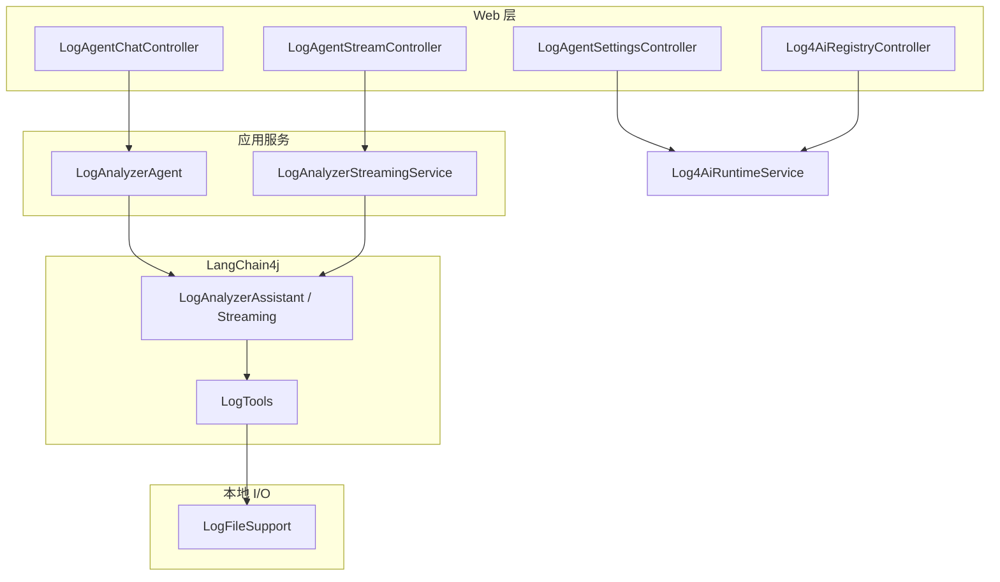

# Spring Boot Log4AI：技术架构与用户执行链路

本文从**使用者视角**描述请求如何进入系统、如何调用大模型与本地日志工具、以及配置/注册两条旁路，便于联调与二次开发。

---

## 1. 项目定位（一句话）

在 **Spring Boot** 进程内，通过 **LangChain4j** 将「兼容 OpenAI API 的大模型」与一组**本地日志工具**（`LogTools`）结合：模型通过 **Tool Calling** 决定读哪份日志、如何检索，最终用自然语言回答用户问题。

- **独立部署**：`Log4AiStandaloneApplication` + 内置静态页 `classpath:/static/log4ai/index.html`。
- **组件嵌入**：其他业务引入 Starter 后，日志分析发生在**该业务进程所在机器**（读本地盘路径）。

---

## 2. 用户可见入口

| 入口 | 说明 |
|------|------|
| 浏览器 | `/log4ai/ui` → 重定向到 `/log4ai/index.html`（控制台） |
| 同步对话 API | `POST /log4ai/chat`，JSON body |
| 流式对话 API | `POST /log4ai/chat/stream`，`Accept: text/event-stream` |
| 运行时设置 | `GET/PUT /log4ai/settings`、`/llm`、`/logs` |
| 日志注册（可选） | `POST /log4ai/registry/register`（需 `log4ai.registry.enabled=true` 与共享密钥） |

关闭 Web 时：`log4ai.web.enabled=false`（仍可有 Agent/Tool，仅无上述 HTTP）。

---

## 3. 总体分层（逻辑视图）



---

## 4. 主链路 A：用户在控制台「提问」（同步）

**用户操作**：在页面输入问题 → 前端 `POST /log4ai/chat`。

**执行顺序**：

1. **HTTP**  
   `LogAgentChatController.chat` 校验 `message`，解析会话 id：请求头 `X-Log4AI-Session` 优先，否则 body 里的 `sessionId`。

2. **应用门面**  
   `LogAnalyzerAgent.ask(sessionId, message)` 将空会话规范为 `"default"`，调用 `LogAnalyzerAssistant.chat(memoryId, userMessage)`。

3. **LangChain4j Agent**  
   `LogAnalyzerAssistant` 由 `AiServices` 生成实现类，带 `@SystemMessage(fromResource = "/prompts/log-analyzer-system.txt")`，按 **MemoryId** 绑定会话记忆。

4. **模型与工具循环**  
   模型在单轮用户消息内可进行多步 **Tool Calling**：选中 `LogTools` 上某个 `@Tool` 方法并传入参数 → 本地执行 → 结果作为 observation 继续生成，直到输出最终自然语言答案。

5. **返回**  
   `ChatResponse` 将最终字符串返回前端。

**代码锚点**：

```java
// LogAgentChatController.java — 入口
@PostMapping("/chat")
public ChatResponse chat(@RequestBody ChatRequest body,
    @RequestHeader(value = "X-Log4AI-Session", required = false) String headerSession) {
  String sid = headerSession != null && !headerSession.isBlank() ? headerSession : body.sessionId();
  return new ChatResponse(agent.ask(sid, body.message()));
}

// LogAnalyzerAgent.java — 会话 id → MemoryId
public String ask(String sessionId, String userMessage) {
  String sid = (sessionId == null || sessionId.isBlank()) ? "default" : sessionId.trim();
  return assistant.chat(sid, userMessage);
}

// LogAnalyzerAssistant.java — 声明式 Agent（系统提示词 + 工具由框架织入）
public interface LogAnalyzerAssistant {
  @SystemMessage(fromResource = "/prompts/log-analyzer-system.txt")
  String chat(@MemoryId String memoryId, @UserMessage String userMessage);
}
```

**Bean 装配**（节选）：`Log4AiAssistantBuilder.buildSyncAssistant` 将 `OpenAiChatModel`、`LogTools`、`ChatMemoryProvider` 绑定到 `LogAnalyzerAssistant`（见 `Log4AiAutoConfiguration`）。

---

## 5. 主链路 B：流式（SSE）

**用户操作**：控制台若走流式，则请求 `POST /log4ai/chat/stream`，响应为 **Server-Sent Events**。

**执行顺序**：

1. `LogAgentStreamController.chatStream` 取得 `LogAnalyzerStreamingService`（未启用流式时返回 **503**）。
2. `LogAnalyzerStreamingService.stream(sessionId, message)` 创建 `SseEmitter`，在**异步线程**中启动 `LogAnalyzerStreamingAssistant` 的 **TokenStream**。
3. 事件类型（简化）：`delta`（文本增量）、`tool`（工具执行摘要）、`done` / `error`。

**代码锚点**：

```java
// LogAgentStreamController.java
@PostMapping(value = "/chat/stream", consumes = APPLICATION_JSON_VALUE, produces = TEXT_EVENT_STREAM_VALUE)
public SseEmitter chatStream(@RequestBody ChatRequest body,
    @RequestHeader(value = "X-Log4AI-Session", required = false) String headerSession) {
  String sid = headerSession != null && !headerSession.isBlank() ? headerSession : body.sessionId();
  return svc.stream(sid, body.message());
}
```

同步与流式共享 **`log4aiChatMemoryProvider`** 与同一套 `sessionId` 时，可在两条通道间复用对话记忆（配置与类路径允许的前提下）。

---

## 6. 工具层：模型如何「读日志」

`LogTools` 上的每个 `@Tool` 方法由模型按需调用，内部委托 **`LogFileSupport`**（路径解析、按服务 id 区分多路日志、脱敏、读文件/检索等）。

**典型参数**：`serviceId` — 多服务场景下与 `log4ai.logs.services` 的键一致；单实例未注册多服务时模型传**空字符串**，内部用 `defaultService` 等规则解析。

**代码锚点**（节选）：

```java
// LogTools.java — 工具方法经 LangChain4j 暴露给模型
@Tool(name = "listLogServices", value = "列出当前已接入的业务服务...")
public String listLogServices() {
  return files.describeServices();
}

@Tool(name = "searchCurrentLog", value = "在指定业务服务的活动日志中按关键字全文检索...")
public String searchCurrentLog(
    @P("业务服务 ID；未注册多服务时传空字符串") String serviceId,
    @P("关键字...") String keyword,
    @P("...") int linesBefore,
    @P("...") int linesAfter) {
  return files.searchCurrent(normServiceId(serviceId), keyword, b, a);
}
```

**配置来源**：`LogAgentProperties`（`log4ai.*`），含 `llm`、`logs.services`、`sanitize` 等；运行时控制台修改会写入 `${user.dir}/.log4ai/settings.json` 并由启动时加载覆盖（见 `Log4AiSettingsPersistence`）。

---

## 7. 旁路：控制台「保存 LLM / 日志服务」

**用户操作**：设置页保存 → `PUT /log4ai/settings/llm` 或 `PUT /log4ai/settings/logs`。

**执行顺序**：

1. `LogAgentSettingsController` 调用 `Log4AiRuntimeService.applyLlm` / `applyLogs`。
2. 更新内存中的 `LogAgentProperties`，`applyLlm` 会 **rebuildAssistants**（重建模型与 Agent）；`applyLogs` 更新多服务映射并持久化。
3. `persistence.save` 写入磁盘，供下次启动恢复。

若开启 `log4ai.registry.disable-ui-log-paths`，控制台**禁止**通过 `applyLogs` 改路径，仅能通过注册接口维护（见下节）。

---

## 8. 旁路：业务应用「注册日志路径」

**用户/系统操作**：业务进程启动时向 Log4AI 服务发 `POST /log4ai/registry/register`，携带共享密钥与 `serviceId`、本机日志路径。

**执行顺序**：

1. `Log4AiRegistryController` 校验 `Authorization` / `X-Log4AI-Registry-Token` 与 `log4ai.registry.shared-secret`。
2. `Log4AiRuntimeService.registerOrUpdateService` 合并单条服务，可选 `Log4AiRegistryPathValidator` 校验路径前缀。
3. 持久化到 `settings.json`。

**代码锚点**：

```java
// Log4AiRegistryController.java（节选）
@PostMapping(path = "/register", consumes = APPLICATION_JSON_VALUE)
public void register(
    @RequestHeader(value = "Authorization", required = false) String authorization,
    @RequestHeader(value = "X-Log4AI-Registry-Token", required = false) String headerToken,
    @RequestBody(required = false) RegistryRegisterRequest body) {
  assertRegistryToken(resolveToken(authorization, headerToken));
  runtime.registerOrUpdateService(body.serviceId(), body.displayName(), body.logPath());
}
```

客户端侧自动注册由 `Log4AiRegistryClientAutoConfiguration` 等在嵌入场景中触发（见 `registry.client` 配置）。

---

## 9. 会话与记忆（为何同一窗口可多轮追问）

`ChatMemoryProvider`（Bean 名 `log4aiChatMemoryProvider`）按 **MemoryId**（即前文的 `sessionId`）维护 `MessageWindowChatMemory`（默认窗口条数见配置/实现）。

因此：**相同 sessionId** 的多轮 `POST /chat` 或流式请求，模型能看到此前用户消息与工具结果，形成连续排查上下文。

---

## 10. 部署形态对路径的含义

| 形态 | 日志路径含义 |
|------|----------------|
| 独立 JAR / Docker | 配置与工具访问的是**进程内可见的本地路径**；Docker 需把宿主机日志 **volume** 挂到容器内，并与 `LOGGING_FILE_NAME` / `services.*.log-path` 一致。 |
| 嵌入业务应用 | 与业务同一机器，直接读业务配置的 `logging.file.name` 等。 |

**Docker 运行用户**：当前 `Dockerfile` 默认以 **root** 启动 JVM（`docker-entrypoint.sh` 直接 `exec java ...`），便于挂载 **`root` 属主、others 无权限** 的日志目录。若需非 root，在 compose 中设 **`user: "1000:1000"`**，并对日志目录做 **`chmod a+rX`** 或 **`chown 1000:1000`**。

---

## 11. 相关源码索引（按阅读顺序）

| 顺序 | 路径 | 作用 |
|------|------|------|
| 1 | `standalone/Log4AiStandaloneApplication.java` | 独立启动与默认配置名 |
| 2 | `autoconfigure/Log4AiAutoConfiguration.java` | ChatModel、LogTools、Assistant、Memory |
| 3 | `web/LogAgentChatController.java` / `LogAgentStreamController.java` | HTTP 入口 |
| 4 | `service/LogAnalyzerAgent.java` / `LogAnalyzerStreamingService.java` | 门面与 SSE 桥接 |
| 5 | `agent/LogAnalyzerAssistant.java` / `LogTools.java` | Agent 接口与工具 |
| 6 | `support/LogFileSupport.java` | 实际读盘与检索 |
| 7 | `runtime/Log4AiRuntimeService.java` | 设置与注册、重建 Agent |
| 8 | `resources/prompts/log-analyzer-system.txt` | 系统提示词 |

---

## 12. 小结

- **主链路**：`POST /log4ai/chat`（或 SSE）→ `LogAnalyzerAgent` → `LogAnalyzerAssistant` → **OpenAI 兼容 API** + **`LogTools`** → **`LogFileSupport`** 读本地日志。  
- **配置链路**：`PUT /log4ai/settings/*` → `Log4AiRuntimeService` → 持久化 + 必要时 **重建 Assistant**。  
- **注册链路**：`POST /log4ai/registry/register` → 合并服务映射 → 持久化。  
- **会话**：`sessionId` / `X-Log4AI-Session` 对齐 **LangChain4j MemoryId**，支撑多轮 ReAct 式排查。

如需对外集成，仅需按相同契约调用 REST/SSE；内置 `index.html` 为同源示例前端。
